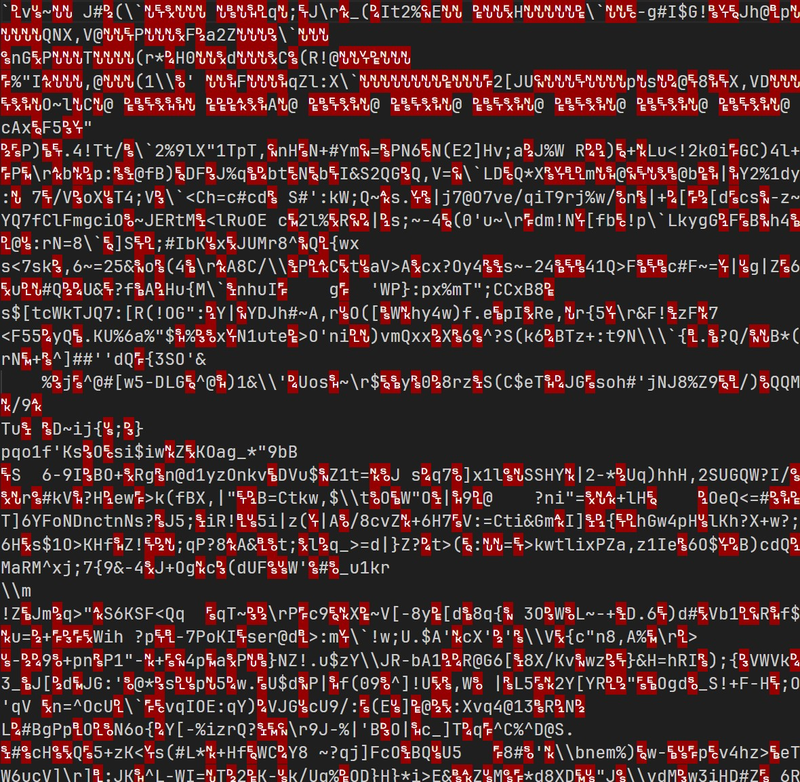

Smaller than base64, only use ASCII, can run in web browser.

The project was born for [vite-plugin-singlefile-compression](https://github.com/bddjr/vite-plugin-singlefile-compression).

## Setup

### npm

```
npm i base128-ascii
```

```js
import base128 from "base128-ascii"
import fs from 'fs'

const encodedTemplate = base128.encode(fs.readFileSync("example.gz")).toJSTemplateLiterals()

const decoded = base128.decode(eval(encodedTemplate))
```

### Browser (jsDelivr CDN)

#### HTML
```html
<script src="https://cdn.jsdelivr.net/npm/base128-ascii@2.1.6/dist/browser.min.js"></script>
```

#### JS
```js
new Promise((rs) => {
  if (self.base128?.EncodeOutput) return rs();
  Object.defineProperty(self, "base128", {
    configurable: true,
    set(value) {
      Object.defineProperty(this, "base128", {
        configurable: true,
        value,
      });
      rs();
    },
  });
  document.head.appendChild(document.createElement("script")).src =
    "https://cdn.jsdelivr.net/npm/base128-ascii@2.1.6/dist/browser.min.js";
}).then(() => {
  console.log("base128 loaded!", self.base128);
});
```

---

## Effect

Encode this jpg file, use base128 is `109.85 KiB` smaller than base64:

```
screenshot-45.519.jpg
file length: 682086

encode:
bytes length: 796961
eval length: 779527
decoded length: 682086
equal: true

base64:
length: 909448
```


