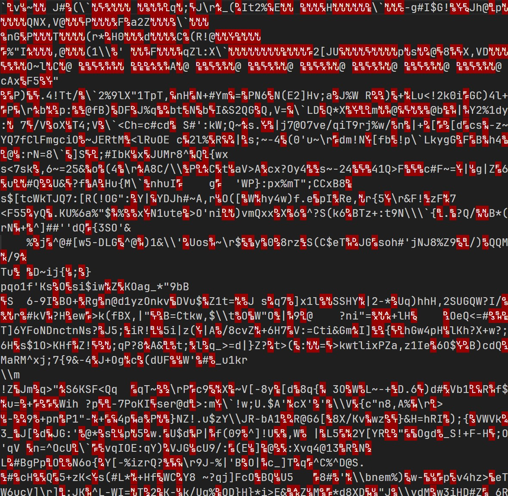

Smaller than base64, only use ASCII, can run in web browser.

The project was born for [vite-plugin-singlefile-compression](https://github.com/bddjr/vite-plugin-singlefile-compression).

## Setup

### npm

```
npm i base128-ascii
```

```js
import base128 from "base128-ascii"
import fs from 'fs'

const encodedTemplate = base128.encode(fs.readFileSync("example.gz")).toJSTemplateLiterals()

const decoded = base128.decode(eval(encodedTemplate))
```

### Browser

```html browser
<script>
{class EncodeOutput{constructor(t){this.uint8Array=t}toString(){return(new TextDecoder).decode(this.uint8Array)}toJSTemplateLiterals(){return`\`${this.toString().replace(/[\r\\`]|\${|<\/script/g,t=>"\r"==t?"\\r":"<\/script"==t?"<\\/script":"\\"+t)}\``}}this.base128={EncodeOutput,encode(t){"string"==typeof t&&(t=(new TextEncoder).encode(t));for(var e=t.length,r=new Uint8Array(Math.ceil(e/7*8)),n=0,c=0;n<e;)r[c++]=t[n]>>1&127,r[c++]=127&(t[n++]<<6|t[n]>>2),r[c++]=127&(t[n++]<<5|t[n]>>3),r[c++]=127&(t[n++]<<4|t[n]>>4),r[c++]=127&(t[n++]<<3|t[n]>>5),r[c++]=127&(t[n++]<<2|t[n]>>6),r[c++]=127&(t[n++]<<1|t[n]>>7),r[c++]=127&t[n++];return new EncodeOutput(r)},decode(t){for(var e,r=t.length,n=new Uint8Array(r/8*7),c=0,o=0,i=()=>(e=t.charCodeAt(c++))>127?e=0:e;c<r;)n[o++]=i()<<1|i()>>6,n[o++]=e<<2|i()>>5,n[o++]=e<<3|i()>>4,n[o++]=e<<4|i()>>3,n[o++]=e<<5|i()>>2,n[o++]=e<<6|i()>>1,n[o++]=e<<7|i();return n}}}
</script>
```

---

## Effect

Encode this jpg file, use base128 is `109.85 KiB` smaller than base64:

```
screenshot-45.519.jpg
file length: 682086

encode:
bytes length: 796961
eval length: 779527
decoded length: 682086
equal: true

base64:
length: 909448
```


